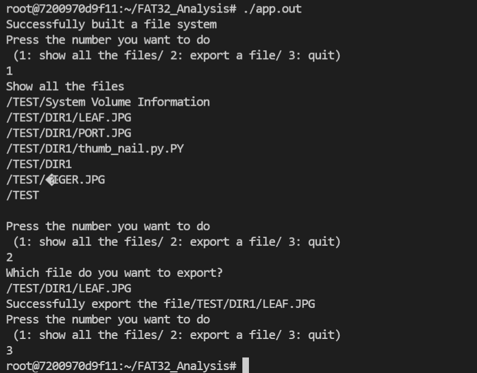

# FAT32 File Explorer

# Requirement
- Build File System FAT32 from a mdf file
- File Explorer(expand all files)
- Save and Export specific file (LEAF.JPG)

# Implementation
- File System (FAT32)
- BootRecord
- FAT
- INode
- Enum (ENTRY_KIND, ATTR)
- LFN Entry (Long File Name)
- Show all the files
- Export LEAF.JPG
- Export PORT.JPG
- Support building via cmake

# External Library used
  - byte_buffer2
  - endian_swap

# Build
```
cmake .
make
```

# Run
```
./app.out  # default input file = FAT32_simple.mdf
or
./app.out <Input File>
```



# License
yielding@hancom.com  
cinxdys2@gmail.com (Jiyoung Shin)  
